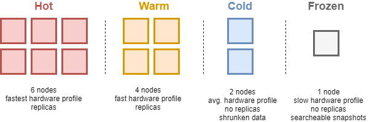
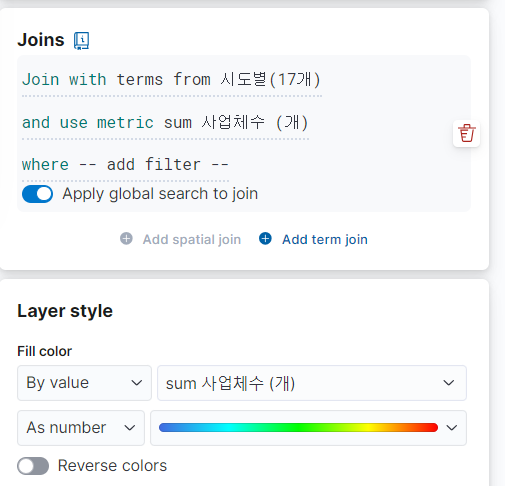
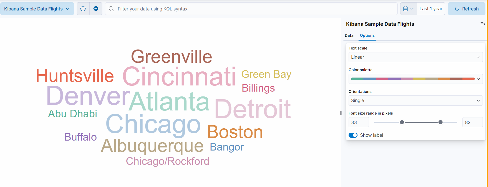

# 📅 8월 8일 학습일지

## 🔍 오늘의 학습 주제: Elasticsearch 심화 - Nori 분석기와 Kibana 활용

오늘은 Elasticsearch의 한국어 형태소 분석기 **Nori**를 깊이 있게 다루고, **Kibana**를 활용한 데이터 시각화 및 분석 실습을 진행했다.

> ### 💡 왜 중요할까?
> - **Nori 분석기**: 한국어 텍스트를 정확하게 검색하고 분석하기 위한 필수 도구입니다. 사용자 사전을 이용한 단어 추가, 품사 태그를 이용한 불용어 처리 등 고급 기능을 통해 검색 품질을 크게 향상시킬 수 있다.
> - **Kibana**: 방대한 데이터를 시각적으로 탐색하고 의미 있는 인사이트를 발견하게 해주는 강력한 대시보드 툴이다. 로그 분석, 비즈니스 인텔리전스, 모니터링 등 다양한 분야에서 활용된다.

---

### 🔬 1. Elasticsearch Nori 분석기 심화

Nori 분석기의 다양한 설정과 토큰 필터를 활용하여 한국어 처리의 정확도를 높일 수 있다.

#### 1.1. 사용자 정의 분석기(Custom Analyzer)와 토크나이저

`nori_tokenizer`를 기반으로 사용자 정의 분석기를 생성하고, `decompound_mode`, `discard_punctuation` 등의 옵션을 설정하는 방법을 실습했다.

```json
// Nori 사용자 정의 분석기 설정 예시
PUT nori_sample
{
  "settings": {
    "index": {
      "analysis": {
        "tokenizer": {
          "nori_user_dict": {
            "type": "nori_tokenizer",
            "decompound_mode": "mixed",
            "user_dictionary": "noridict_ko.txt"
          }
        },
        "analyzer": {
          "my_analyzer": {
            "type": "custom",
            "tokenizer": "nori_user_dict"
          }
        }
      }
    }
  }
}
```

#### 1.2. 사용자 사전 활용

`user_dictionary` 옵션을 통해 '세종시'와 같은 복합명사를 하나의 토큰으로 인식시키거나, 분해된 결과를 함께 반환하도록 설정할 수 있습니다.

- **기본 분석**: "세종시" → `세종시` (하나의 토큰)
- **사전 적용 후 (`세종시 세종 시`)**: "세종시" → `세종시`, `세종`, `시` (여러 토큰)

#### 1.3. Nori 토큰 필터 종류 및 활용

| 필터 종류 | 설명 | 주요 파라미터/기능 |
| :--- | :--- | :--- |
| **`nori_part_of_speech`** | 특정 품사(POS)를 가진 토큰을 제거함 | `stoptags`: 제거할 품사 태그 배열 (예: "E", "J") |
| **`nori_readingform`** | 한자(Hanja)로 된 토큰을 한글 발음으로 변환함 | 예: "鄕歌" → "향가" |
| **`nori_number`** | "십만이천오백"과 같은 한글/혼합 숫자를 아라비아 숫자로 정규화 | 예: "삼만 이천" → "32000" |
| **`synonym`** | 동의어를 처리하기 위한 필터 | `synonyms_path`로 동의어 파일 지정 |

---

### 📈 2. Kibana 데이터 시각화 및 분석

Kibana의 핵심 기능들을 배우고, 실제 데이터를 활용하여 대시보드를 구축하는 실습을 진행했다.

#### 2.1. Kibana 핵심 기능

- **Discover**: Document 단위로 데이터를 탐색하고 쿼리 및 필터링을 수행
- **Visualize Library**: 다양한 차트를 생성
- **Dashboard**: 생성된 시각화 요소들을 모아 한눈에 볼 수 있는 대시보드를 구성
- **Canvas**: 인포그래픽 스타일의 동적인 프레젠테이션을 제작
- **Maps**: 위치 기반 데이터를 지도 위에 시각화

#### 2.2. 데이터 뷰 (Data View)

여러 인덱스를 묶어주는 가상 인덱스로, Kibana에서 데이터를 분석하기 위한 필수 요소입니다. 날짜별로 분리된 인덱스(`my_index-2023-08-08`)들을 `my_index-*` 패턴으로 묶어 하나의 데이터 소스처럼 사용할 수 있게 해준다



#### 2.3. 실습: 대시보드 만들기

##### 맵(Maps) 활용

- **EMS(Elastic Maps Service)** 의 경계 데이터를 활용하여 대한민국 시/도별 데이터를 시각화
- `Join` 기능을 사용하여 인덱스의 지역 필드와 지도 경계의 지역 이름을 연결할 수도 있었다


##### 태그 클라우드(Tag Cloud)

- 텍스트 데이터의 출현 빈도를 시각적으로 표현하는 기능
- 특정 필드(예: 은행 이름)를 기준으로 집계하여 어떤 값이 많이 나타나는지 쉽게 파악할 수 있다


#### 2.4. KQL vs Lucene 쿼리

Kibana 검색창에서 사용하는 두 가지 쿼리 언어의 차이점

| 구분 | KQL (Kibana Query Language) | Lucene |
| :--- | :--- | :--- |
| **문법** | 사용자 친화적 (`field : value`) | 전문가용, 더 복잡함 (`field:value`) |
| **범위** | 비교 연산자 (`>`, `<=`) 사용 | `[]`(포함), `{}`(미포함) 사용 |
| **논리** | `and`, `or`, `not` | `+`(AND), `-`(NOT), (OR) |

- **Inspect** 메뉴를 통해 KQL로 작성한 쿼리가 실제 Elasticsearch의 **Query DSL**로 어떻게 변환되는지 확인할 수 있습니다.

#### 2.5. ES|QL (Elasticsearch Query Language)

- `FROM ... | WHERE ...` 와 같이 파이프라이닝을 지원하는 새로운 쿼리 언어
- 데이터 탐색 및 변환, 집계를 순차적으로 수행하는 데 유용함
```sql
-- ES|QL 예시
FROM banksalad-user01,banksalad-user02
| WHERE `대분류` == "생활" AND `메모` == "강서구"
```

---

### ✨ 오늘 배운 것 요약

- Nori 분석기의 사용자 사전과 토큰 필터를 사용해 한국어 검색의 정확도를 높일 수 있다.
- Kibana는 데이터 뷰를 통해 여러 인덱스의 데이터를 통합하고, Maps, Tag Cloud 등 다양한 시각화 도구를 제공한다.
- KQL은 사용자 친화적인 검색 언어이며, Inspect 기능을 통해 복잡한 Query DSL로 변환되는 과정을 확인할 수 있다.
- ES|QL은 파이프 기반의 새로운 쿼리 언어로 데이터 탐색과 분석을 더욱 유연하게 만든다.
