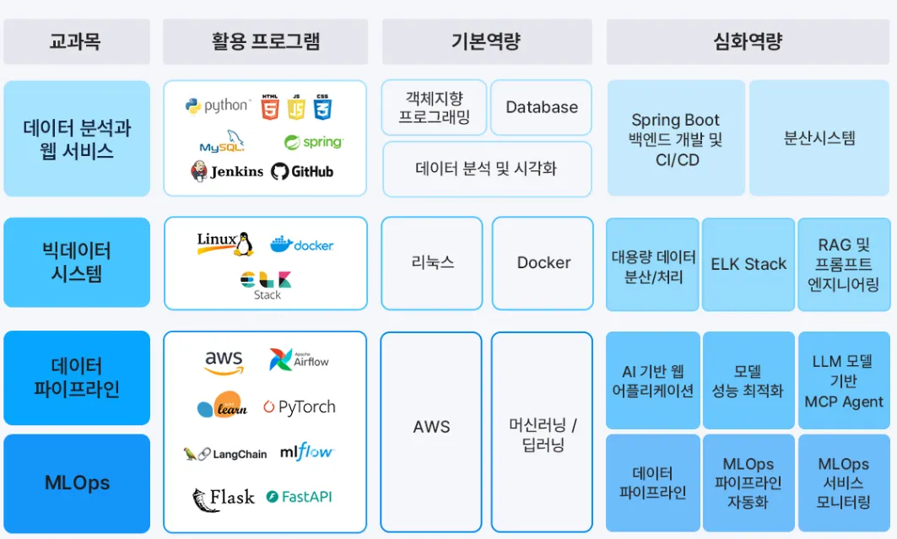

# 🐍 Python 데이터 분석 & AI 엔지니어링 스터디 노트

이 공간은 파이썬을 활용한 데이터 분석과 AI 엔지니어링 학습 과정을 기록하고 정리하는 저장소입니다. 스터디 내용은 주차별로 나누어 기록하고, 특정 주제에 대한 심화 학습은 '외전'으로 관리합니다.

---

## 📚 학습 내용 바로가기

- [**1️⃣ 1주차 학습 내용**](./1주차/README.md)
- [**2️⃣ 2주차 학습 내용**](./2주차/README.md)
- [**3️⃣ 3주차 학습 내용**](./3주차/11_day.md)
- [**📚 외전: 추가 학습 자료**](./외전/README.md)