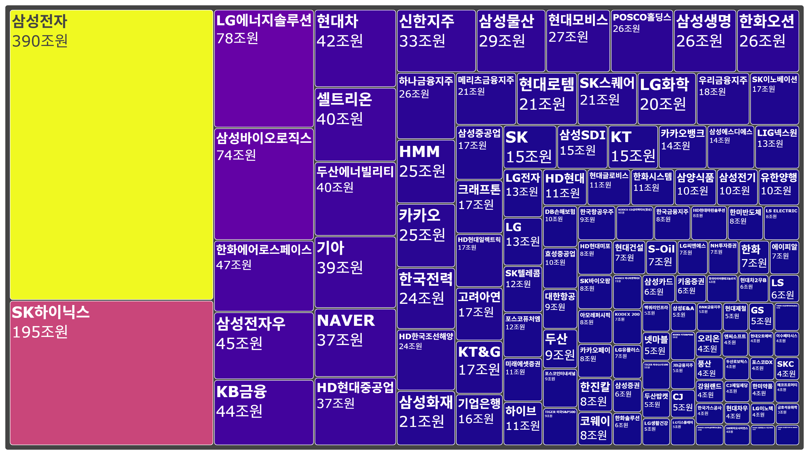

# 네이버 증권 시가총액 데이터 분석 및 시각화

## 📝 프로젝트 개요

이 프로젝트는 네이버 증권 웹사이트에서 코스피(KOSPI) 상장 기업들의 시가총액 데이터를 크롤링하고, 이를 분석하여 트리맵(Treemap)으로 시각화하는 과정을 담고 있습니다.

Playwright를 활용하여 동적 웹 페이지의 데이터를 수집하고, Pandas로 데이터를 정제 및 가공한 뒤, Plotly를 사용하여 시각적 인사이트를 도출하는 전체 데이터 파이프라인을 경험하는 것을 목표로 합니다.

---

## ✨ 주요 기능

- **데이터 수집**: Playwright를 사용하여 네이버 증권의 코스피 시가총액 순위 페이지에서 기업명, 현재가, 시가총액 등의 데이터를 자동 수집
- **데이터 정제**: Pandas를 활용하여 수집된 데이터에서 불필요한 문자를 제거하고, 숫자 형식으로 변환하는 등 전처리 수행
- **데이터 시각화**: 처리된 데이터를 바탕으로 기업별 시가총액 비중을 한눈에 파악할 수 있는 트리맵 생성
- **자동화**: URL 쿼리 스트링을 조작하여 여러 페이지에 걸친 데이터를 효율적으로 수집하는 로직 구현

---

## 🛠️ 사용 기술

- **언어**: Python
- **웹 크롤링**: `Playwright`
- **데이터 분석**: `Pandas`
- **데이터 시각화**: `Plotly`, `Kaleido`
- **기타**: `nbformat` (Jupyter Notebook 형식 지원)

---

## ⚙️ 설치 및 실행 방법

### 1. 저장소 복제 및 의존성 설치

```bash
# 프로젝트 디렉터리로 이동
cd C:\devs\ITStudy\self_python\ch_07

# 가상환경 생성 및 활성화 (권장)
python -m venv .venv
source .venv/bin/activate  # Windows: .venv\Scripts\activate

# 필요한 패키지 설치
pip install -U playwright kaleido nbformat pandas plotly
```

### 2. 브라우저 드라이버 설치

Playwright가 웹 브라우저를 제어하기 위해 필요한 드라이버를 설치합니다.

```bash
python -m playwright install
```

### 3. 스크립트 실행

프로젝트는 데이터 수집, 정제, 시각화 단계로 구성된 여러 스크립트 파일로 이루어져 있습니다. 각 단계에 맞는 스크립트를 순서대로 실행합니다.

- **`step_1_*.py`**: 데이터 수집 관련 스크립트
- **`step_2_*.py`**: 페이지 이동 자동화 스크립트
- **`step_3_*.py`**: 데이터 처리 및 시각화 스크립트

---

## 📖 학습 과정 및 경험

### 데이터 수집: Playwright와의 첫 만남

처음에는 `Playwright`의 `inspector` 도구를 사용하여 사용자의 행동을 녹화하고 코드를 생성하는 방식으로 접근했습니다. 이 과정에서 동적 웹 페이지의 구조를 파악하고, 원하는 HTML 요소를 선택하는 방법을 익힐 수 있었습니다. 특히, `page.pause()`를 활용해 실행을 잠시 멈추고 현재 페이지의 상태를 디버깅하는 기능이 매우 유용했습니다.

한 가지 흥미로웠던 점은, 참고하던 자료와 실제 네이버 증권의 URL 구조가 변경되었다는 사실이었습니다. 이를 통해 웹 크롤링 시에는 대상 웹사이트의 구조가 언제든지 변경될 수 있음을 인지하고, 유연하게 대처하는 능력이 중요하다는 것을 깨달았습니다.

### 자동화: 쿼리 스트링의 재발견

여러 페이지에 걸친 데이터를 수집하기 위해 URL의 **쿼리 스트링(Query String)** 구조를 분석했습니다. `?page={페이지번호}`와 같이 간단한 파라미터 조작만으로 여러 페이지를 효율적으로 탐색할 수 있다는 점을 배웠고, 이를 통해 반복적인 데이터 수집 작업을 성공적으로 자동화할 수 있었습니다.

### 데이터 시각화: 트리맵으로 표현하는 시장

수집한 데이터를 단순히 나열하는 것을 넘어, "시장에서 각 기업이 차지하는 비중"을 효과적으로 전달하고 싶었습니다. 이를 위해 **트리맵**이 가장 적합한 시각화 방식이라고 판단했습니다.

`Plotly`를 사용하여 시가총액 상위 기업들의 데이터를 트리맵으로 시각화하는 과정은 매우 흥미로웠습니다. `fig.update_traces()`와 `fig.update_layout()` 함수를 통해 차트의 세부적인 디자인(텍스트, 색상 등)을 조정하며, 데이터의 가독성을 높이는 방법을 배울 수 있었습니다.

---

## 📊 결과물

아래는 코스피 상장 기업들의 시가총액을 비중을 기준으로 시각화한 트리맵입니다.



---
---

[🚀 미니 프로젝트: 채용 공고 분석 및 시각화](README.md)