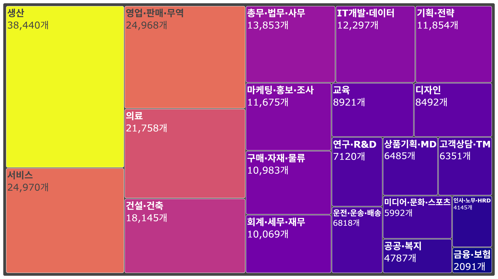

# 사람인 직종별 채용 공고 데이터 분석 및 시각화

## 📝 프로젝트 개요

이 프로젝트는 채용 웹사이트 사람인에서 특정 직종의 채용 공고 데이터를 크롤링하고, 이를 분석하여 직종별 공고 수를 막대그래프로 시각화하는 과정을 담고 있습니다.

Playwright를 활용하여 동적 웹 페이지의 데이터를 수집하고, Pandas로 데이터를 정제 및 가공한 뒤, Plotly를 사용하여 시각적 인사이트를 도출하는 전체 데이터 파이프라인을 경험하는 것을 목표로 합니다.

---

## ✨ 주요 기능

- **데이터 수집**: Playwright를 사용하여 사람인의 특정 직종 채용 공고 수 데이터를 자동 수집
- **데이터 정제**: Pandas를 활용하여 수집된 데이터에서 불필요한 문자를 제거하고, 숫자 형식으로 변환하는 등 전처리 수행
- **데이터 시각화**: 처리된 데이터를 바탕으로 직종별 공고 수를 한눈에 파악할 수 있는 막대그래프 생성
- **자동화**: 여러 직종에 걸친 데이터를 효율적으로 수집하는 로직 구현

---

## 🛠️ 사용 기술

- **언어**: Python
- **웹 크롤링**: `Playwright`
- **데이터 분석**: `Pandas`
- **데이터 시각화**: `Plotly`, `Kaleido`

---

## ⚙️ 설치 및 실행 방법

### 1. 저장소 복제 및 의존성 설치

```bash
# 프로젝트 디렉터리로 이동
cd C:\devs\ITStudy\self_python\ch_07\recruit_analyse

# 가상환경 생성 및 활성화 (권장)
python -m venv .venv
source .venv/bin/activate  # Windows: .venv\Scripts\activate

# 필요한 패키지 설치
pip install -U playwright kaleido pandas plotly
```

### 2. 브라우저 드라이버 설치

Playwright가 웹 브라우저를 제어하기 위해 필요한 드라이버를 설치합니다.

```bash
python -m playwright install
```

### 3. 스크립트 실행

프로젝트는 데이터 수집, 정제, 시각화 단계로 구성된 여러 스크립트 파일로 이루어져 있습니다. 각 단계에 맞는 스크립트를 순서대로 실행합니다.

- **`play_wright.py`**: Playwright를 이용해 사람인 웹사이트에서 직종별 채용 공고 수를 크롤링하여 JSON 파일로 저장합니다.
- **`pre_process.py`**: 수집된 JSON 데이터를 정제하여 다시 JSON 파일로 저장합니다.
- **`json_to_csv.py`**: 정제된 JSON 파일을 CSV 파일로 변환합니다.
- **`job_recruit_count.py`**: CSV 파일을 읽어 직종별 공고 수를 집계하여 JSON 파일로 저장합니다.
- **`output_img.py`**: 집계된 데이터를 바탕으로 Plotly를 사용하여 막대그래프를 생성하고 이미지 파일로 저장합니다.

---

## 📊 결과물

아래는 직종별 채용 공고 수를 시각화한 막대그래프입니다.


