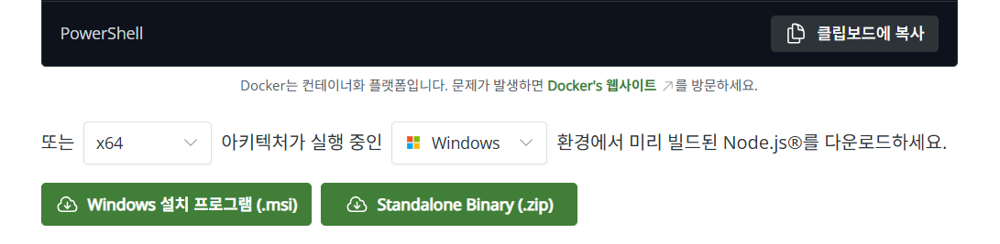

# Windows Gemini CLI 설치 가이드

명령줄(CLI) 환경에 익숙하지 않은 사용자를 위해, Windows PC에 Gemini CLI를 설치하고 기본 설정을 마치는 전 과정을 기록

### Gemini CLI 소개

- 터미널 환경에서 Google의 Gemini AI 모델과 직접 상호작용하며 파일 분석, 코드 생성 등 다양한 작업을 수행하게 해주는 도구

---

## 1단계: 사전 준비 - Node.js 설치하기

Gemini CLI는 Node.js 런타임 환경을 기반으로 동작하므로, 먼저 Node.js를 설치해야 함.

1.  **Node.js 다운로드**
    - [https://nodejs.org/ko/download](https://nodejs.org/ko/download) 링크로 접속.
    - **LTS (Long Term Support)** 버전의 **Windows 설치 프로그램 (.msi)**를 다운로드함. LTS 버전이 가장 안정적임.

    

2.  **설치 프로그램 실행**
    - 다운로드한 `.msi` 파일을 실행하고, 설치 마법사의 안내에 따라 진행.
    - 대부분의 경우, `Next` 버튼을 누르고 라이선스 동의에 체크하면 됨.

    

    

3.  **설치 완료**
    - 별도의 설정 변경 없이 `Next`를 눌러 설치를 완료함.

    

---

## 2단계: Gemini CLI 설치하기

Node.js 준비 후, Gemini CLI를 설치할 차례임.

1.  **PowerShell 또는 명령 프롬프트(cmd) 실행**
    - `Win` 키를 누르고 `powershell` 또는 `cmd`를 검색해서 실행.

2.  **설치 명령어 입력**
    - 아래 명령어를 복사하여 PowerShell 창에 붙여넣고 `Enter` 키를 누름.

    ```powershell
    npm install -g @google/gemini-cli
    ```
    > **💡 명령어 정보**
    > - `npm`: Node.js 설치 시 함께 설치되는 패키지 관리 도구.
    > - `install`: 패키지 설치 명령어.
    > - `-g`: `--global`의 약자로, PC의 어떤 경로에서든 `gemini` 명령어를 사용할 수 있도록 전역으로 설치하는 옵션.

    

---

## 3단계: Gemini CLI 초기 설정 및 로그인

설치 완료 후, Gemini를 처음 실행하여 계정과 연동하는 과정.

1.  **Gemini 첫 실행**
    - PowerShell 창에 `gemini` 를 입력하고 `Enter` 실행.

2.  **테마 선택**
    - 화살표 키로 테마를 선택하고 `Enter`를 누름. (테마는 나중에 변경 가능)

    

3.  **로그인 방식 선택**
    - Gemini 사용을 위한 인증 방식 선택. 3가지 옵션이 있음.

    

    > **🤔 각 방식의 특징**
    > 1.  **Sign in with Google (권장)**: 가장 간편하며, 일일 무료 요청 횟수가 많음.
    > 2.  **Gemini API Key**: 직접 발급받은 API 키를 사용. 1.5 Pro 모델 사용 가능.
    > 3.  **Vertex AI**: Google Cloud 고급 사용자용 옵션.

4.  **Google 계정으로 인증하기**
    - `Sign in with Google`을 선택하면 웹 브라우저가 실행됨.
    - 사용할 Google 계정으로 로그인하고, 권한을 허용함.

    

    - 인증 성공 시, 웹페이지에 성공 메시지가 나타남.

    

---

## 4단계: 사용자 맞춤 설정 (Context 파일)

Gemini CLI의 주요 기능으로, **`GEMINI.md`** 파일을 통해 AI의 역할과 답변 스타일을 미리 지정할 수 있음.

1.  **`GEMINI.md` 파일의 역할**
    - AI 모델이 대화 시 항상 참고하는 **기본 설정집**.
    - "모든 답변은 한국어로 할 것"과 같은 규칙을 미리 정해두면, 이후의 모든 대화에 해당 규칙이 적용됨.

2.  **설정 파일 경로 확인**
    - `C:\Users\사용자이름\.gemini` 경로에 Gemini CLI의 설정 파일들이 저장됨.
    - `사용자이름`은 본인의 Windows 계정 이름.

3.  **규칙 정의하기**
    - AI에게 부여할 역할이나 원하는 답변 스타일을 정의함.

    > **예시)**
    > 1.  모든 답변은 반드시 한국어로 작성할 것.
    > 2.  파이썬 코드 요청 시, 가독성 좋은 코드를 주석과 함께 작성할 것.
    > 3.  문서 정리 요청 시, 핵심 내용은 **굵게** 강조하고 표나 리스트를 활용할 것.

4.  **규칙 번역 (선택 사항)**
    - AI가 영어 규칙을 더 잘 이해하는 경향이 있으므로, 작성한 규칙을 영어로 번역하면 인식률이 향상될 수 있음.

    

    

5.  **`GEMINI.md` 파일 생성 및 저장하기**
    - 정의한 규칙이 담긴 `GEMINI.md` 파일을 생성.
    - 해당 파일을 위에서 확인한 경로(`C:\Users\사용자이름\.gemini`) 안에 저장함.

6.  **설정 적용 확인**
    - PowerShell에서 `gemini`를 다시 실행했을 때, `Using 1 GEMINI.md file` 메시지가 출력되면 성공적으로 적용된 것임.

    

---

이것으로 Gemini CLI를 사용하기 위한 모든 설정이 완료됨. 터미널에서 `gemini "1+1 결과는?"` 와 같이 질문하며 기능을 활용할 수 있음.